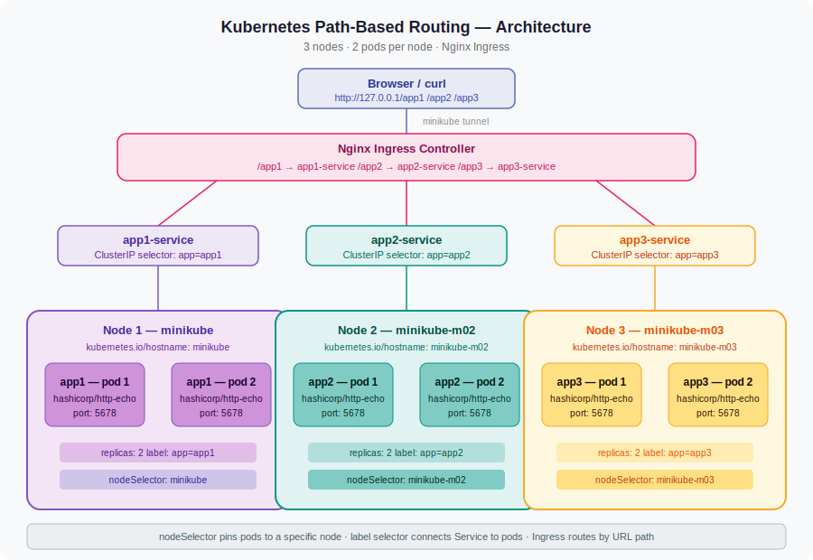
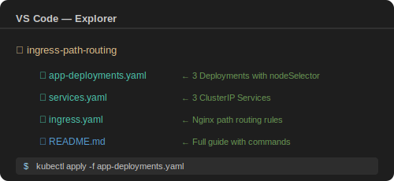
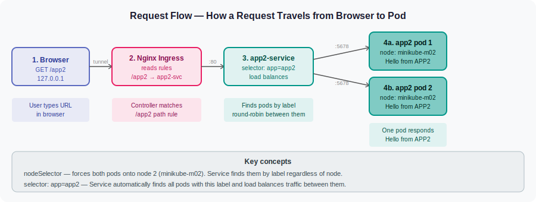

# Kubernetes Path-Based Routing
### 3 nodes · 2 pods per node · Nginx Ingress · VS Code + CMD

---

## Architecture



---

## Project folder structure



---

## What we are building

```
minikube (node 1)      → app1-pod-1  +  app1-pod-2
minikube-m02 (node 2)  → app2-pod-1  +  app2-pod-2
minikube-m03 (node 3)  → app3-pod-1  +  app3-pod-2
```

Traffic routing via Nginx Ingress:

| URL path | Service | Pods |
|---|---|---|
| `http://127.0.0.1/app1` | app1-service | 2 pods on node 1 |
| `http://127.0.0.1/app2` | app2-service | 2 pods on node 2 |
| `http://127.0.0.1/app3` | app3-service | 2 pods on node 3 |

---

## How a request travels — step by step



---

## Files in this project

| File | What it creates |
|---|---|
| `app-deployments.yaml` | 3 Deployments — pins 2 pods to each node using nodeSelector |
| `services.yaml` | 3 ClusterIP Services — each finds pods by label selector |
| `ingress.yaml` | Nginx Ingress routing rules — URL path to Service |

---

## Phase 1 — Start Minikube with 3 nodes

Run in VS Code terminal (CMD):

```cmd
minikube start --nodes 3 --driver docker
```

What each part means:
- `minikube start` — boots a local Kubernetes cluster on your machine
- `--nodes 3` — creates 3 nodes instead of the default 1
- `--driver docker` — uses Docker Desktop as the engine (most stable on Windows)

Verify all 3 nodes are Ready:

```cmd
kubectl get nodes
```

Expected output:
```
NAME           STATUS   ROLES           AGE
minikube       Ready    control-plane   2m
minikube-m02   Ready    <none>          1m
minikube-m03   Ready    <none>          1m
```

What each column means:
- `STATUS: Ready` — node is healthy and can accept pods
- `ROLES: control-plane` — minikube is the master node that manages scheduling
- `ROLES: none` — m02 and m03 are worker nodes that run your pods

---

## Phase 2 — Enable Nginx Ingress addon

```cmd
minikube addons enable ingress
```

What this does: deploys the Nginx controller pod inside the ingress-nginx namespace.
Without this, your Ingress resource is just a stored YAML object — nothing reads it and no routing happens.

Wait for the controller to be Running:

```cmd
kubectl get pods -n ingress-nginx -w
```

What each part means:
- `-n ingress-nginx` — look inside the ingress-nginx namespace
- `-w` — watch mode, keeps refreshing live

Wait until you see 1/1 Running then press Ctrl+C.

Create the project folder:

```cmd
mkdir ingress-path-routing
cd ingress-path-routing
```

---

## Phase 3 — Create the 3 YAML files in VS Code

In VS Code File Explorer — right-click the folder → New File — create these 3 files:
- app-deployments.yaml
- services.yaml
- ingress.yaml

---

## Phase 4 — Apply all files

```cmd
kubectl apply -f app-deployments.yaml
```

What happens: Kubernetes creates 3 Deployments. The scheduler reads each nodeSelector
and places 2 pods on the correct node.

```cmd
kubectl apply -f services.yaml
```

What happens: Creates 3 ClusterIP Services. Each Service immediately starts watching
for pods with its matching label.

```cmd
kubectl apply -f ingress.yaml
```

What happens: Creates the Ingress resource. The Nginx controller picks it up within
seconds and updates its internal routing config.

---

## Phase 5 — Verify everything

Check pods are on the correct nodes:

```cmd
kubectl get pods -o wide
```

Expected output:
```
NAME                          READY   STATUS    NODE
app1-deployment-xxx-aaa       1/1     Running   minikube
app1-deployment-xxx-bbb       1/1     Running   minikube
app2-deployment-xxx-ccc       1/1     Running   minikube-m02
app2-deployment-xxx-ddd       1/1     Running   minikube-m02
app3-deployment-xxx-eee       1/1     Running   minikube-m03
app3-deployment-xxx-fff       1/1     Running   minikube-m03
```

Check services:

```cmd
kubectl get svc
```

Expected:
```
NAME           TYPE        CLUSTER-IP     PORT(S)
app1-service   ClusterIP   10.96.x.x      80/TCP
app2-service   ClusterIP   10.96.x.x      80/TCP
app3-service   ClusterIP   10.96.x.x      80/TCP
```

Check the Ingress resource:

```cmd
kubectl get ingress
```

Expected:
```
NAME                 CLASS   HOSTS   ADDRESS     PORTS
path-based-ingress   nginx   *       127.0.0.1   80
```

ADDRESS shows 127.0.0.1 only after minikube tunnel is running.

---

## Phase 6 — Start Minikube tunnel and test

Terminal 1 — keep this open the entire time:

```cmd
minikube tunnel
```

Creates a network route from your Windows machine into the cluster so
127.0.0.1 reaches the Ingress controller.

Terminal 2 — open with Ctrl+Shift+5 in VS Code — test each route:

```cmd
curl http://127.0.0.1/app1
```
Expected: Hello from APP1

```cmd
curl http://127.0.0.1/app2
```
Expected: Hello from APP2

```cmd
curl http://127.0.0.1/app3
```
Expected: Hello from APP3

Or open your browser and type http://127.0.0.1/app1 directly.

---

## Debug commands

Pod stuck in Pending — nodeSelector hostname is wrong:

```cmd
kubectl describe pod <pod-name>
```

Look at the Events section. You will see: node(s) didn't match node selector

Fix — check exact node names first:

```cmd
kubectl get nodes
```

Then update kubernetes.io/hostname in your YAML to match exactly.

See Nginx controller logs:

```cmd
kubectl logs -n ingress-nginx -l app.kubernetes.io/component=controller --tail=30
```

See which pod handled each request:

```cmd
kubectl logs -l app=app1 --prefix=true
```

See full Ingress routing rules registered:

```cmd
kubectl describe ingress path-based-ingress
```

---

## Clean up

```cmd
kubectl delete -f ingress.yaml
kubectl delete -f services.yaml
kubectl delete -f app-deployments.yaml
minikube stop
minikube delete
```

minikube delete wipes all 3 nodes and all data. Use this for a clean fresh start.

---

## All commands in exact order — quick reference

```cmd
minikube start --nodes 3 --driver docker
kubectl get nodes
minikube addons enable ingress
kubectl get pods -n ingress-nginx -w
mkdir ingress-path-routing
cd ingress-path-routing
kubectl apply -f app-deployments.yaml
kubectl get pods -o wide
kubectl apply -f services.yaml
kubectl get svc
kubectl apply -f ingress.yaml
kubectl get ingress
minikube tunnel
curl http://127.0.0.1/app1
curl http://127.0.0.1/app2
curl http://127.0.0.1/app3
```
