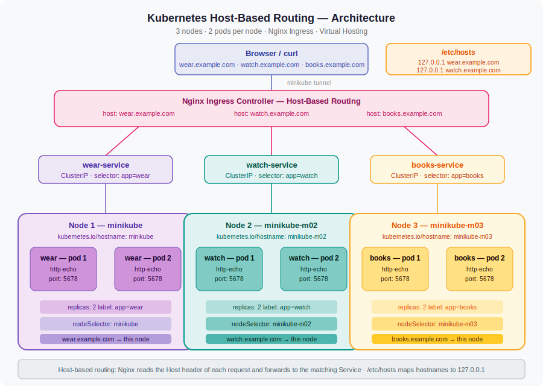
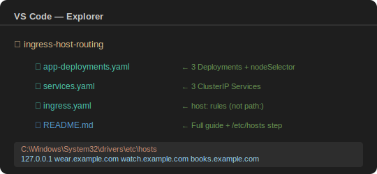
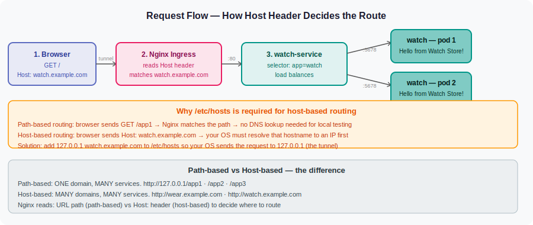

# Kubernetes Host-Based Routing
### 3 nodes · 2 pods per node · Nginx Ingress · Virtual Hosting · VS Code + CMD

---

## Architecture



---

## Project folder structure



---

## What we are building

```
minikube (node 1)      → wear-pod-1  +  wear-pod-2
minikube-m02 (node 2)  → watch-pod-1 +  watch-pod-2
minikube-m03 (node 3)  → books-pod-1 +  books-pod-2
```

Traffic routing via Nginx Ingress — by hostname:

| Hostname | Service | Pods |
|---|---|---|
| `http://wear.example.com` | wear-service | 2 pods on node 1 |
| `http://watch.example.com` | watch-service | 2 pods on node 2 |
| `http://books.example.com` | books-service | 2 pods on node 3 |

---

## How a request travels and why /etc/hosts is required



---

## Key difference from path-based routing

In path-based routing, Nginx reads the **URL path** (`/app1`, `/app2`) to decide where to route.

In host-based routing, Nginx reads the **Host header** (`wear.example.com`) to decide where to route.

Because `wear.example.com` is a fake domain, your OS needs to know it resolves to `127.0.0.1`.
That is what the `/etc/hosts` step does — it maps the hostname to the tunnel IP before any request is sent.

---

## Files in this project

| File | What it creates |
|---|---|
| `app-deployments.yaml` | 3 Deployments — pins 2 pods to each node using `nodeSelector` |
| `services.yaml` | 3 ClusterIP Services — each finds pods by `label selector` |
| `ingress.yaml` | Nginx Ingress host rules — hostname → Service |

---

## Phase 1 — Start Minikube with 3 nodes

Run in VS Code terminal (CMD):

```cmd
minikube start --nodes 3 --driver docker
```

What each part means:
- `minikube start` — boots a local Kubernetes cluster on your machine
- `--nodes 3` — creates 3 nodes instead of the default 1
- `--driver docker` — uses Docker Desktop as the engine (most stable on Windows)

Verify all 3 nodes are Ready:

```cmd
kubectl get nodes
```

Expected output:
```
NAME           STATUS   ROLES           AGE
minikube       Ready    control-plane   2m
minikube-m02   Ready    <none>          1m
minikube-m03   Ready    <none>          1m
```

What each column means:
- `STATUS: Ready` — node is healthy and can accept pods
- `ROLES: control-plane` — minikube is the master node that manages scheduling
- `ROLES: none` — m02 and m03 are worker nodes that run your pods

---

## Phase 2 — Enable Nginx Ingress addon

```cmd
minikube addons enable ingress
```

What this does: deploys the Nginx controller pod inside the `ingress-nginx` namespace.
Without this, your Ingress resource is just stored YAML — nothing reads it and no routing happens.

Wait for the controller to be Running:

```cmd
kubectl get pods -n ingress-nginx -w
```

Wait until you see `1/1 Running` then press `Ctrl+C`.

Create the project folder:

```cmd
mkdir ingress-host-routing
cd ingress-host-routing
```

---

## Phase 3 — CRITICAL: Add hostnames to /etc/hosts

This step is unique to host-based routing. Your OS must know how to resolve the fake hostnames.

**Step 1 — Get the tunnel IP (always 127.0.0.1 for Minikube):**

```cmd
minikube tunnel
```

Keep this terminal open. Open a second terminal for the remaining commands.

**Step 2 — Open Notepad as Administrator:**

```
Start Menu → search Notepad → right-click → Run as Administrator
```

**Step 3 — Open the hosts file:**

```
File → Open → navigate to:
C:\Windows\System32\drivers\etc\hosts
```

Change file filter from "Text Documents" to "All Files" to see the hosts file.

**Step 4 — Add these 3 lines at the bottom:**

```
127.0.0.1  wear.example.com
127.0.0.1  watch.example.com
127.0.0.1  books.example.com
```

**Step 5 — Save the file** (Ctrl+S).

What this does: tells your Windows OS that whenever something tries to connect
to `wear.example.com`, send it to `127.0.0.1` (which `minikube tunnel` routes into the cluster).

Verify the entries were saved:

```cmd
type C:\Windows\System32\drivers\etc\hosts
```

You should see your 3 lines at the bottom.

---

## Phase 4 — Create the 3 YAML files in VS Code

In VS Code File Explorer — right-click the folder → **New File** — create these 3 files.

---

## Phase 5 — Apply all files

```cmd
kubectl apply -f app-deployments.yaml
```

What happens: Kubernetes creates 3 Deployments. The scheduler reads each `nodeSelector`
and places 2 pods on the correct node.

```cmd
kubectl apply -f services.yaml
```

What happens: Creates 3 ClusterIP Services. Each Service immediately starts watching
for pods with its matching label.

```cmd
kubectl apply -f ingress.yaml
```

What happens: Creates the Ingress resource with host-based rules. The Nginx controller
reads the `host:` field in each rule and updates its virtual hosting config.

---

## Phase 6 — Verify everything

Check pods are on the correct nodes:

```cmd
kubectl get pods -o wide
```

Expected output:
```
NAME                         READY   STATUS    NODE
wear-deployment-xxx-aaa      1/1     Running   minikube
wear-deployment-xxx-bbb      1/1     Running   minikube
watch-deployment-xxx-ccc     1/1     Running   minikube-m02
watch-deployment-xxx-ddd     1/1     Running   minikube-m02
books-deployment-xxx-eee     1/1     Running   minikube-m03
books-deployment-xxx-fff     1/1     Running   minikube-m03
```

Check services:

```cmd
kubectl get svc
```

Expected:
```
NAME            TYPE        CLUSTER-IP     PORT(S)
wear-service    ClusterIP   10.96.x.x      80/TCP
watch-service   ClusterIP   10.96.x.x      80/TCP
books-service   ClusterIP   10.96.x.x      80/TCP
```

Check the Ingress resource:

```cmd
kubectl get ingress
```

Expected:
```
NAME                CLASS   HOSTS                                                    PORTS
host-based-ingress  nginx   wear.example.com,watch.example.com,books.example.com    80
```

Notice the HOSTS column now shows your domain names — this is different from path-based
routing which shows `*` (wildcard). Each host has its own routing rule.

See the full routing rules registered:

```cmd
kubectl describe ingress host-based-ingress
```

---

## Phase 7 — Test all 3 routes

With `minikube tunnel` still running in terminal 1, open terminal 2:

```cmd
curl http://wear.example.com
```
Expected: `Hello from Wear Store!`

```cmd
curl http://watch.example.com
```
Expected: `Hello from Watch Store!`

```cmd
curl http://books.example.com
```
Expected: `Hello from Books Store!`

Or open your browser and type `http://wear.example.com` directly — no port needed.

Test load balancing — run the same URL multiple times:

```cmd
curl http://watch.example.com
curl http://watch.example.com
curl http://watch.example.com
```

The Service round-robins between watch pod 1 and watch pod 2 on node `minikube-m02`.

---

## Debug commands

Pod stuck in Pending — nodeSelector hostname is wrong:

```cmd
kubectl describe pod <pod-name>
```

Look at the Events section. You will see: `node(s) didn't match node selector`

Fix — check exact node names first:

```cmd
kubectl get nodes
```

Then update `kubernetes.io/hostname` in your YAML to match exactly.

Getting `curl: (6) Could not resolve host` — /etc/hosts was not saved correctly:

```cmd
ping wear.example.com
```

If ping says `could not find host`, the hosts file entry is missing or was not saved.
Repeat Phase 3 — make sure Notepad was opened as Administrator.

Getting 404 from Nginx — hostname in curl does not match the Ingress rule exactly:

```cmd
kubectl describe ingress host-based-ingress
```

Check the Rules section. The hostname in your curl command must match exactly — including
capitalisation and spelling — what is in the Ingress `host:` field.

See Nginx controller logs:

```cmd
kubectl logs -n ingress-nginx -l app.kubernetes.io/component=controller --tail=30
```

See which pod handled each request:

```cmd
kubectl logs -l app=wear --prefix=true
```

---

## Clean up

```cmd
kubectl delete -f ingress.yaml
kubectl delete -f services.yaml
kubectl delete -f app-deployments.yaml
minikube stop
minikube delete
```

Also remove the lines from `C:\Windows\System32\drivers\etc\hosts` (open as Administrator,
delete the 3 lines you added, save).

---

## All commands in exact order — quick reference

```cmd
minikube start --nodes 3 --driver docker
kubectl get nodes
minikube addons enable ingress
kubectl get pods -n ingress-nginx -w
mkdir ingress-host-routing
cd ingress-host-routing
[edit C:\Windows\System32\drivers\etc\hosts — add 3 lines]
kubectl apply -f app-deployments.yaml
kubectl get pods -o wide
kubectl apply -f services.yaml
kubectl get svc
kubectl apply -f ingress.yaml
kubectl get ingress
kubectl describe ingress host-based-ingress
minikube tunnel
curl http://wear.example.com
curl http://watch.example.com
curl http://books.example.com
```
