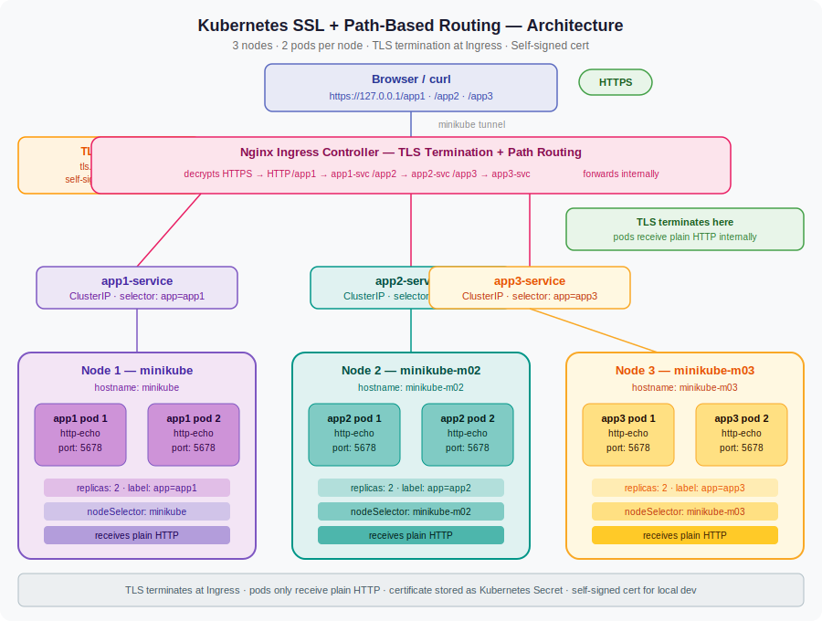
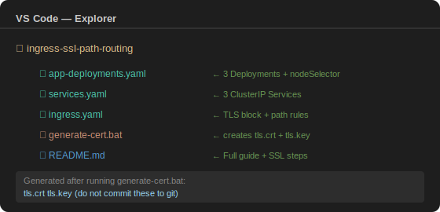
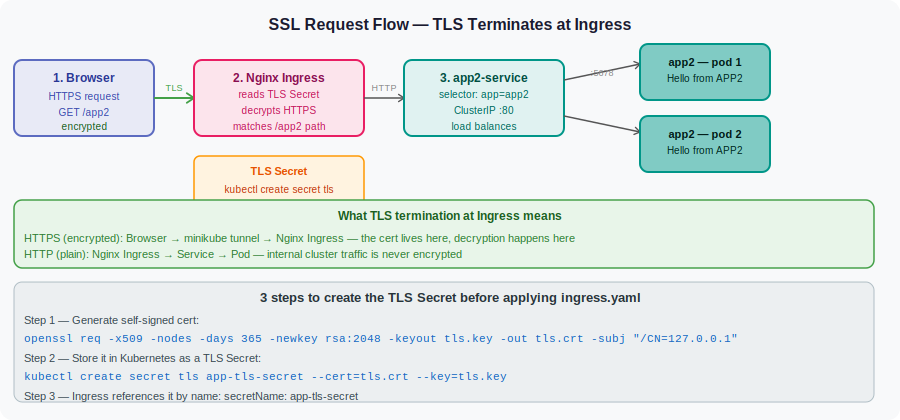

# Kubernetes SSL + Path-Based Routing
### 3 nodes · 2 pods per node · TLS termination at Ingress · Self-signed cert · VS Code + CMD

---

## Architecture



---

## Project folder structure



---

## What we are building

```
minikube (node 1)      → app1-pod-1  +  app1-pod-2
minikube-m02 (node 2)  → app2-pod-1  +  app2-pod-2
minikube-m03 (node 3)  → app3-pod-1  +  app3-pod-2
```

Traffic routing via Nginx Ingress over HTTPS:

| URL | Service | Pods |
|---|---|---|
| `https://127.0.0.1/app1` | app1-service | 2 pods on node 1 |
| `https://127.0.0.1/app2` | app2-service | 2 pods on node 2 |
| `https://127.0.0.1/app3` | app3-service | 2 pods on node 3 |

---

## How TLS termination works



The browser sends an encrypted HTTPS request. The Nginx Ingress Controller
decrypts it using the certificate stored in the TLS Secret, then forwards
plain HTTP traffic to the Service and pods internally. The pods never
see or handle any encryption — that is entirely the Ingress controller's job.

---

## Files in this project

| File | What it does |
|---|---|
| `app-deployments.yaml` | 3 Deployments — pins 2 pods to each node using `nodeSelector` |
| `services.yaml` | 3 ClusterIP Services — each finds pods by `label selector` |
| `ingress.yaml` | Nginx Ingress with `tls:` block + path routing rules |
| `generate-cert.bat` | Generates `tls.crt` and `tls.key` using OpenSSL |

---

## Phase 1 — Start Minikube with 3 nodes

Run in VS Code terminal (CMD):

```cmd
minikube start --nodes 3 --driver docker
```

What each part means:
- `minikube start` — boots a local Kubernetes cluster on your machine
- `--nodes 3` — creates 3 nodes instead of the default 1
- `--driver docker` — uses Docker Desktop as the engine (most stable on Windows)

Verify all 3 nodes are Ready:

```cmd
kubectl get nodes
```

Expected output:
```
NAME           STATUS   ROLES           AGE
minikube       Ready    control-plane   2m
minikube-m02   Ready    <none>          1m
minikube-m03   Ready    <none>          1m
```

---

## Phase 2 — Enable Nginx Ingress addon

```cmd
minikube addons enable ingress
```

What this does: deploys the Nginx controller pod inside the `ingress-nginx` namespace.
Without this, your Ingress resource is just stored YAML — nothing reads it and no routing happens.

Wait for the controller to be Running:

```cmd
kubectl get pods -n ingress-nginx -w
```

Wait until you see `1/1 Running` then press `Ctrl+C`.

Create the project folder:

```cmd
mkdir ingress-ssl-path-routing
cd ingress-ssl-path-routing
```

---

## Phase 3 — CRITICAL: Generate the TLS certificate

This step is unique to SSL routing. You need a certificate and private key
before you can create the TLS Secret that Ingress uses.

For local development we use a self-signed certificate. Browsers will show
a warning (because no Certificate Authority signed it) but the encryption works.

**Step 1 — Check OpenSSL is installed:**

```cmd
openssl version
```

If you get an error, install it: https://slproweb.com/products/Win32OpenSSL.html

**Step 2 — Generate the self-signed certificate:**

```cmd
openssl req -x509 -nodes -days 365 -newkey rsa:2048 ^
  -keyout tls.key ^
  -out tls.crt ^
  -subj "/CN=127.0.0.1/O=LocalDev"
```

What each part means:
- `req -x509` — generate a self-signed certificate (not a CSR)
- `-nodes` — do not encrypt the private key with a passphrase
- `-days 365` — certificate valid for 1 year
- `-newkey rsa:2048` — generate a new 2048-bit RSA key pair at the same time
- `-keyout tls.key` — save the private key to this file
- `-out tls.crt` — save the certificate to this file
- `-subj "/CN=127.0.0.1"` — set the Common Name to 127.0.0.1 (our Minikube tunnel IP)
- `^` — CMD line continuation character (same as `\` in bash)

After running this, you will see two new files in your folder:

```
tls.crt   ← the certificate (public, shareable)
tls.key   ← the private key (keep secret, never commit to git)
```

**Step 3 — Store the certificate in Kubernetes as a TLS Secret:**

```cmd
kubectl create secret tls app-tls-secret --cert=tls.crt --key=tls.key
```

What each part means:
- `kubectl create secret tls` — create a Secret of type kubernetes.io/tls
- `app-tls-secret` — the name of the Secret (must match `secretName:` in ingress.yaml)
- `--cert=tls.crt` — path to the certificate file
- `--key=tls.key` — path to the private key file

Kubernetes stores both files inside the Secret object. The Ingress controller
mounts this Secret and uses it to perform TLS handshakes with browsers.

**Verify the Secret was created:**

```cmd
kubectl get secret app-tls-secret
```

Expected output:
```
NAME             TYPE                DATA   AGE
app-tls-secret   kubernetes.io/tls   2      5s
```

- `TYPE: kubernetes.io/tls` — confirms this is a TLS Secret, not a generic one
- `DATA: 2` — confirms both `tls.crt` and `tls.key` are stored inside

---

## Phase 4 — Create the 3 YAML files in VS Code

In VS Code File Explorer — right-click the folder → **New File** — create these 3 files.

---

## Phase 5 — Apply all files

```cmd
kubectl apply -f app-deployments.yaml
```

What happens: Kubernetes creates 3 Deployments. The scheduler reads each `nodeSelector`
and places 2 pods on the correct node.

```cmd
kubectl apply -f services.yaml
```

What happens: Creates 3 ClusterIP Services. Each Service immediately starts watching
for pods with its matching label.

```cmd
kubectl apply -f ingress.yaml
```

What happens: Creates the Ingress resource with a `tls:` block. Nginx reads the
`app-tls-secret`, loads the certificate and key, starts accepting HTTPS on port 443,
and routes decrypted traffic to the correct service based on the URL path.

---

## Phase 6 — Verify everything

Check pods are on the correct nodes:

```cmd
kubectl get pods -o wide
```

Expected output:
```
NAME                          READY   STATUS    NODE
app1-deployment-xxx-aaa       1/1     Running   minikube
app1-deployment-xxx-bbb       1/1     Running   minikube
app2-deployment-xxx-ccc       1/1     Running   minikube-m02
app2-deployment-xxx-ddd       1/1     Running   minikube-m02
app3-deployment-xxx-eee       1/1     Running   minikube-m03
app3-deployment-xxx-fff       1/1     Running   minikube-m03
```

Check the TLS Secret exists:

```cmd
kubectl get secret app-tls-secret
```

Check services:

```cmd
kubectl get svc
```

Check the Ingress resource — PORTS column must show 80, 443:

```cmd
kubectl get ingress
```

Expected:
```
NAME              CLASS   HOSTS   ADDRESS     PORTS
ssl-path-ingress  nginx   *       127.0.0.1   80, 443
```

Notice PORTS now shows `80, 443` — this confirms TLS is enabled.

---

## Phase 7 — Start Minikube tunnel and test

Terminal 1 — keep this open the entire time:

```cmd
minikube tunnel
```

Terminal 2 — test each HTTPS route:

```cmd
curl -k https://127.0.0.1/app1
```
Expected: `Hello from APP1`

```cmd
curl -k https://127.0.0.1/app2
```
Expected: `Hello from APP2`

```cmd
curl -k https://127.0.0.1/app3
```
Expected: `Hello from APP3`

What `-k` means: tells curl to accept the self-signed certificate without
verifying it against a trusted Certificate Authority. Required for local
dev with self-signed certs. In production you would never use `-k`.

Test that HTTP redirects to HTTPS (ssl-redirect annotation):

```cmd
curl -v http://127.0.0.1/app1
```

Expected: you will see `301 Moved Permanently` with `Location: https://127.0.0.1/app1`
This confirms the automatic HTTP to HTTPS redirect is working.

Test in browser: open `https://127.0.0.1/app1` — click through the security
warning (self-signed cert) and you will see the response.

---

## Debug commands

**Ingress PORTS column shows only 80 — TLS not enabled:**

```cmd
kubectl describe ingress ssl-path-ingress
```

Look at the TLS section. If it says `SNI routes` are missing, the Secret name
in `ingress.yaml` does not match the actual Secret name.

Check the exact secret name:
```cmd
kubectl get secrets
```

Then update `secretName:` in `ingress.yaml` to match exactly.

**curl returns `SSL handshake failed`:**

The TLS Secret may be missing or corrupted. Re-create it:
```cmd
kubectl delete secret app-tls-secret
kubectl create secret tls app-tls-secret --cert=tls.crt --key=tls.key
```

**Pod stuck in Pending — nodeSelector hostname is wrong:**

```cmd
kubectl describe pod <pod-name>
```

Look at the Events section. Fix by checking exact node names:
```cmd
kubectl get nodes
```

**See Nginx controller logs:**

```cmd
kubectl logs -n ingress-nginx -l app.kubernetes.io/component=controller --tail=30
```

**See which pod handled each request:**

```cmd
kubectl logs -l app=app1 --prefix=true
```

**See full Ingress routing rules and TLS config:**

```cmd
kubectl describe ingress ssl-path-ingress
```

---

## Clean up

```cmd
kubectl delete -f ingress.yaml
kubectl delete -f services.yaml
kubectl delete -f app-deployments.yaml
kubectl delete secret app-tls-secret
minikube stop
minikube delete
```

Also delete the cert files if you no longer need them:
```cmd
del tls.crt tls.key
```

---

## All commands in exact order — quick reference

```cmd
minikube start --nodes 3 --driver docker
kubectl get nodes
minikube addons enable ingress
kubectl get pods -n ingress-nginx -w
mkdir ingress-ssl-path-routing
cd ingress-ssl-path-routing
openssl req -x509 -nodes -days 365 -newkey rsa:2048 -keyout tls.key -out tls.crt -subj "/CN=127.0.0.1/O=LocalDev"
kubectl create secret tls app-tls-secret --cert=tls.crt --key=tls.key
kubectl get secret app-tls-secret
kubectl apply -f app-deployments.yaml
kubectl get pods -o wide
kubectl apply -f services.yaml
kubectl get svc
kubectl apply -f ingress.yaml
kubectl get ingress
minikube tunnel
curl -k https://127.0.0.1/app1
curl -k https://127.0.0.1/app2
curl -k https://127.0.0.1/app3
curl -v http://127.0.0.1/app1
```
